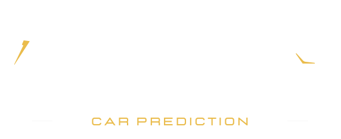

<p align="center">

</p>

## Project Overview

**Oculus - Car Prediction** is a Flask-based web application that interfaces with the **Willhaben** and **Gebrauchtwagen**
APIs. It enables users to search for used cars on Willhaben, retrieve comprehensive information about each vehicle,
and display predicted selling prices using a machine learning model trained with data from **Gebrauchtwagen.at**.
Additionally, the application offers price prediction capabilities for buyers, allowing them to determine the optimal
purchase price for a desired vehicle. Hosted on a Microsoft Azure Ubuntu server with a robust Microsoft SQL database,
Oculus ensures reliability, scalability, and efficient data management for all users.

## API Endpoints

### Willhaben API

**Oculus - Car Prediction** leverages the Willhaben API to fetch detailed information about used cars listed on
Willhaben. The following endpoints are utilized:

#### 1. Search for a Car

- **Method:** `GET`
- **URL:** `https://www.willhaben.at/webapi/iad/search/atz/seo/gebrauchtwagen/auto/gebrauchtwagenboerse`
- **Description:** Searches for used cars on Willhaben based on various criteria.
- **Parameters:**
    - `keyword` (string, optional): Search keyword for the car.
    - `page` (integer, optional): Page number for pagination. Default is `1`.
    - `rows` (integer, optional): Number of results per page. Default is `30`.
    - `sort` (integer, optional): Sorting preference. For example, `1` for relevance.
    - `car_model_make` (string, optional): Make of the car (e.g., BMW, Audi).
    - `car_model_model` (string, optional): Model of the car.
    - `price_from` (integer, optional): Minimum price.
    - `price_to` (integer, optional): Maximum price.
    - `mileage_from` (integer, optional): Minimum mileage.
    - `mileage_to` (integer, optional): Maximum mileage.
    - `year_model_from` (integer, optional): Minimum model year.
    - `year_model_to` (integer, optional): Maximum model year.
    - `car_type` (string, optional): Type of car (e.g., SUV, sedan).
    - `motor_condition` (string, optional): Condition of the motor (e.g., new, used).
    - `warranty` (string, optional): Warranty information.
    - `engine_effect_from` (string, optional): Minimum engine power.
    - `engine_effect_to` (string, optional): Maximum engine power.
    - `engine_fuel` (string, optional): Fuel type (e.g., petrol, diesel).
    - `battery_capacity_from` (string, optional): Minimum battery capacity.
    - `battery_capacity_to` (string, optional): Maximum battery capacity.
    - `wltp_range_from` (string, optional): Minimum range for electric cars.
    - `wltp_range_to` (string, optional): Maximum range for electric cars.
    - `transmission` (string, optional): Transmission type (e.g., automatic, manual).
    - `wheel_drive` (string, optional): Drive type (e.g., AWD, FWD).
    - `equipment` (list, optional): List of equipment features.
    - `exterior_colour_main` (string, optional): Main exterior color.
    - `no_of_doors_from` (string, optional): Minimum number of doors.
    - `no_of_doors_to` (string, optional): Maximum number of doors.
    - `no_of_seats_from` (string, optional): Minimum number of seats.
    - `no_of_seats_to` (string, optional): Maximum number of seats.
    - `area_id` (string, optional): Location area ID.
    - `dealer` (string, optional): Dealer type.
    - `periode` (integer, optional): Time period for search results in hours.

#### 2. Get Car Details

- **Method:** `GET`
- **URL:** `https://www.willhaben.at/webapi/iad/car/details/{car_id}`
- **Description:** Retrieves detailed information about a specific car listing.
- **Parameters:**
    - `car_id` (string, required): The unique identifier of the car listing.

#### 3. Get Car Equipment

- **Method:** `GET`
- **URL:** `https://www.willhaben.at/webapi/iad/car/equipment/{car_id}`
- **Description:** Fetches the equipment and features of a specific car.
- **Parameters:**
    - `car_id` (string, required): The unique identifier of the car listing.

### Gebrauchtwagen API

**Oculus - Car Prediction** utilizes the Gebrauchtwagen API to obtain additional data for training the machine learning
model and enhancing price predictions. The following endpoints are employed:

#### 1. Fetch Vehicle Makes

- **Method:** `GET`
- **URL:** `https://www.gebrauchtwagen.at/api/taxonomy/makes/`
- **Description:** Retrieves a list of all available vehicle makes.
- **Parameters:** None

#### 2. Fetch Vehicle Models

- **Method:** `GET`
- **URL:** `https://www.gebrauchtwagen.at/api/taxonomy/makes/{make_id}/models`
- **Description:** Retrieves models for a specific vehicle make.
- **Parameters:**
    - `make_id` (integer, required): The unique identifier of the vehicle make.

#### 3. Search Listings

- **Method:** `GET`
- **URL:** `https://www.gebrauchtwagen.at/api/v2/search-listings`
- **Description:** Searches for vehicle listings based on specified criteria.
- **Parameters:**
    - `sort` (string, optional): Sorting criteria (e.g., `year`).
    - `desc` (integer, optional): Sort direction (`0` for ascending, `1` for descending). Default is `0`.
    - `custtype` (string, optional): Customer type (e.g., `D` for dealer).
    - `ustate` (string, optional): Vehicle state (e.g., `N`, `C`, `U`).
    - `safemake` (string, optional): Safe make name (e.g., `bmw`).
    - `safemodel` (string, optional): Safe model name (e.g., `x5`).
    - `fregfrom` (integer, optional): From registration year.
    - `page` (integer, optional): Page number for pagination.

#### 4. Fetch Listing Details

- **Method:** `GET`
- **URL:** `https://www.gebrauchtwagen.at/api/v2/listing/{listing_id}`
- **Description:** Retrieves detailed information about a specific vehicle listing.
- **Parameters:**
    - `listing_id` (string, required): The unique identifier of the vehicle listing.

## Setup Instructions

### Prerequisites

Before setting up the **Oculus - Car Prediction** application, ensure you have the following:

- **Microsoft Azure Account:** An active Azure account to provision resources.
- **Ubuntu 24.04 Server:** The application is hosted on an Ubuntu 24.04 server with the following specifications:
    - **Instance Type:** Standard B2s
    - **vCPUs:** 2
    - **Memory:** 4 GiB
- **Python 3.12.3:** The application requires Python version 3.12.3.
- **Certbot:** For SSL certificate installation to secure the application.
- **Redis:** Utilized for background worker tasks.
- **Celery:** Required to manage asynchronous tasks and background processing.

### How to Run the Project

1. **Clone the Repository**
   ```bash
   git clone https://github.com/AI-Team-Lab/Oculus.git
   cd Oculus
   ```

2. **Set up Environment Variables**
   Create a `.env` file in the project root directory:
   ```
   DB_HOST=<hostname>
   DB_PORT=<port>
   DB_USER=<user>
   DB_PASSWORD=<password>
   DB_DATABASE=Oculus
   ```

3. **Database Setup**  
   Install the database structure using the provided SQL script:
   ```bash
   sqlcmd -S <hostname> -U <user> -P <password> -d Oculus -i sql/oculus_mssql_tables.sql
   ```

4. **Generate SSL Certificates with Certbot**  
   To secure the application with HTTPS, use **Certbot** to create SSL/TLS certificates:
    - Install Certbot:
      ```bash
      sudo apt update
      sudo apt install certbot
      ```
    - Generate the certificates:  
      Replace `<your_domain>` with your actual domain or server IP.
      ```bash
      sudo certbot certonly --standalone -d <your_domain>
      ```
    - After the process completes, the certificates will be located in:
      ```
      /etc/letsencrypt/live/<your_domain>/
      ```
        - `fullchain.pem`: The full certificate chain.
        - `privkey.pem`: The private key.

    - Copy the certificates to the project directory:
      ```bash
      sudo cp /etc/letsencrypt/live/<your_domain>/fullchain.pem /home/ocuadmin/Oculus/config/certs/
      sudo cp /etc/letsencrypt/live/<your_domain>/privkey.pem /home/ocuadmin/Oculus/config/certs/
      ```

5. **Configure Services**  
Create and enable services:

- **Create `oculus.service` under `/etc/systemd/system/`**:
  ```ini
  [Unit]
  Description=Gunicorn instance to serve Flask application (HTTPS)
  After=network.target

  [Service]
  User=ocuadmin
  Group=ocuadmin
  WorkingDirectory=/home/ocuadmin/Oculus
  Environment="PATH=/home/ocuadmin/Oculus/.venv/bin"
  ExecStart=/home/ocuadmin/Oculus/.venv/bin/gunicorn -w 1 -b 0.0.0.0:5000 app:app \
      --certfile=/home/ocuadmin/Oculus/config/certs/fullchain.pem \
      --keyfile=/home/ocuadmin/Oculus/config/certs/privkey.pem \
      --log-level info \
      --access-logfile /home/ocuadmin/Oculus/logs/access.log \
      --error-logfile /home/ocuadmin/Oculus/logs/error.log

  [Install]
  WantedBy=multi-user.target
  ```

- **Create `celery.service` under `/etc/systemd/system/`**:
  ```ini
  [Unit]
  Description=Celery Worker for Oculus
  After=network.target

  [Service]
  User=ocuadmin
  Group=ocuadmin
  WorkingDirectory=/home/ocuadmin/Oculus
  Environment="PATH=/home/ocuadmin/Oculus/.venv/bin"
  ExecStart=/home/ocuadmin/Oculus/.venv/bin/celery -A oculus.tasks worker --loglevel=info

  [Install]
  WantedBy=multi-user.target
  ```

Enable and start the services:

   ```bash
   sudo systemctl daemon-reload
   sudo systemctl enable redis celery oculus
   sudo systemctl start redis celery oculus
   ```

6. **Set Up Cron Jobs for Periodic Tasks**  
   To automate periodic data updates and transformations, configure `crontab` to execute the necessary scripts:

    - Edit the crontab file:
      ```bash
      crontab -e
      ```

    - Add the following entries to schedule tasks:
      ```bash
      # Runs every 48 hours at 2 AM to check for new data
      0 2 */2 * * /bin/bash /home/ocuadmin/Oculus/config/crontab/run_periodic_task.sh
 
      # Runs every 48 hours at 4 AM to move and transform data from staging to data warehouse
      0 4 */2 * * /bin/bash /home/ocuadmin/Oculus/config/crontab/run_dl2dwh_task.sh
 
      # Reboots the server daily at midnight
      0 0 * * * /usr/bin/sudo /sbin/shutdown -r now
      ```

    - **Task Scripts**:
        - `run_periodic_task.sh`: Ensures new data is fetched and processed.
        - `run_dl2dwh_task.sh`: Moves data from staging tables or data lake into the data warehouse and performs
          transformations for a structured overview.

    - Ensure the scripts have execution permissions:
      ```bash
      chmod +x /home/ocuadmin/Oculus/config/crontab/run_periodic_task.sh
      chmod +x /home/ocuadmin/Oculus/config/crontab/run_dl2dwh_task.sh
      ```

7. **Run the Application**  
   Access the application in your browser using HTTPS:
   ```
   https://<your_domain>:5000
   ```
   
## License

This project is licensed under the MIT License. See the [LICENSE](LICENSE) file for details.
